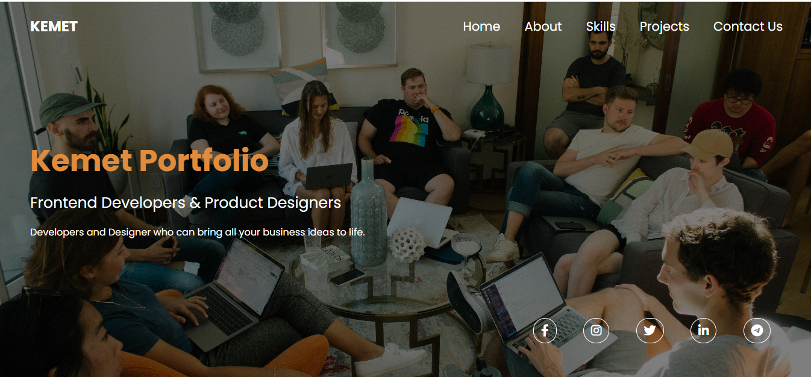
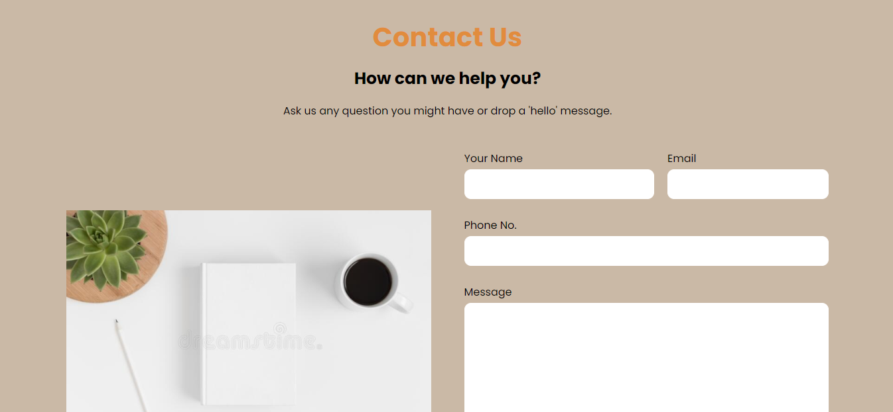

# Kamet Portfolio

This is a one-page portfolio to showcase the work we the members of Portfolio-team-2 of Side Hustle Bootcamp Cohort 5.0 did.
We are frontend developers and all projects were built using HTML, CSS, and Javascript only. 

The portfolio consists of different sections: 
* About Us 
* Skills
* Projects and
* Contact Us among others

You can read about our experience [here](https://kamet.hashnode.dev/kemet-portfolio)

## :page_facing_up: Table of contents

- [Kamet Portfolio](#kamet-portfolio)
	- [:page\_facing\_up: Table of contents](#page_facing_up-table-of-contents)
	- [:camera: Screenshots](#camera-screenshots)
	- [:signal\_strength: Technologies](#signal_strength-technologies)
	- [:cool: Live-Solution](#cool-live-solution)
	- [:envelope: Contact](#envelope-contact)
	- [:pen: Contributors](#pen-contributors)

## :camera: Screenshots

## :signal_strength: Technologies

* [HTML](https://html.com/) for markup.
* [CSS](https://developer.mozilla.org/en-US/docs/Web/CSS) for styling.
* [Javascript](https://www.javascript.com/) for adding functionalities and making it interactive.
* [Netlify](https://www.netlify.com/) for hosting the project.

## :cool: Live-Solution

* Here is the [link](https://kamet-portfolio.netlify.app/) to the clone.

## :envelope: Contact

* Repo created by [Moyinoluwa](https://github.com/moyinoluwa-10/), email: moyinadelowo@gmail.com

## :pen: Contributors

* [Moyinoluwa](https://github.com/moyinoluwa-10/)
* [Tobechukwu](https://github.com/TOBAE/)
* [Ebuka](https://github.com/tzfocus7/)
* [Mardiyyah](https://github.com/Mardie328/)
* [Ayotoke](https://github.com/tokebillions/)
* [Victor](https://github.com/chuka00/)
* [Julius](https://github.com/MacJulius48/)
* [Tobi](https://github.com/Toby48-K/)

